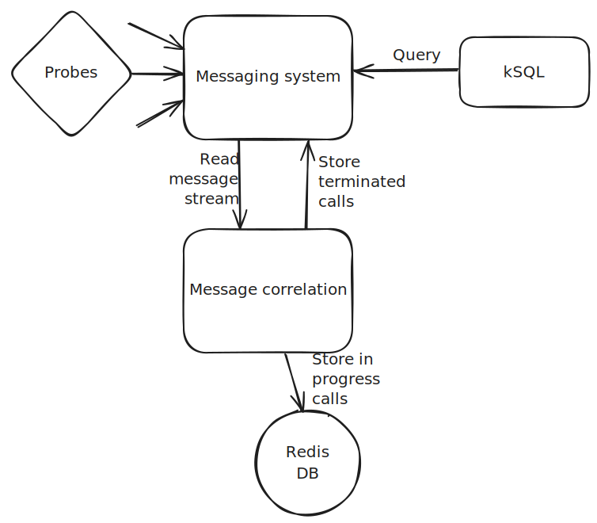

# Introduction

While learning Apache Kafka and then Apache Pulsar, I realized that these would be great tools to correlate signalling messages stored in a stream. Thus I decided to build a POC for it.

